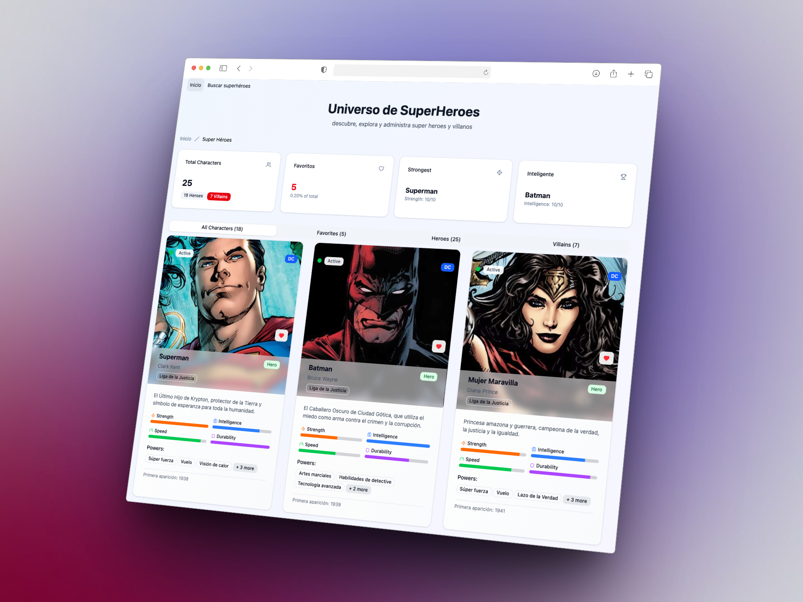
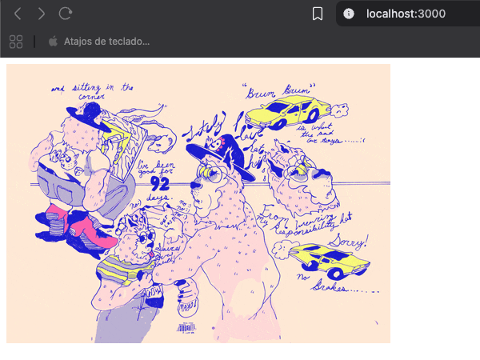

# React: De cero a experto (Hooks y MERN) [Fernando Herrera](https://github.com/Klerith)

[curso de fernando herrera](https://www.udemy.com/course/react-cero-experto/)

## Algunos proyectos fueron:
| | |
|:-------------------------:|:-------------------------:|
[Teslo Shop](https://teslo-shop.julianll.dev)  |[Heroes-2025](https://heroes-2025.julianll.dev/)  | 
[gif-app](https://gif-app.julianll.dev/)  |  [heroes-2022](https://react-super-heroes.julianll.dev/)  
hooks   | Redux Toolkit 
React inicio  | 

## Introducción a React

- [x] ¿Qué es React?
- [x] Creación de un proyecto de React
- [x] Componentes y JSX

## Fundamentos de React

- [x] State y Props
- [x] Ciclo de vida de los componentes
- [x] Eventos y manejo de eventos

## React Hooks

- [x] Introducción a los Hooks
- [x] useState Hook
- [x] useEffect Hook
- [x] useContext Hook

## React Router

- [x] Configuración de React Router
- [x] Navegación entre rutas
- [x] Parámetros y redirecciones

## Tanstack Query

- [x] Instalación y configuration y devtools
- [x] Guardado de parámetros y obtención de parámetros

## Zod

- [x] Instalación y configuration
- [x] Validación de datos y tipos

## Redux - se esta remplazando por zustand

- [x] Introducción a Redux
- [x] Store, Reducers y Actions, State, Middlewares, Dispatch
- [x] Acciones asíncronas, RTK query, Redux Toolkit, Slices
- [x] Conexión de Redux con React

## Zustand

- [x] Introducción a zustand
- [x] Store(State), Getters, Actions

## Aplicaciones MERN

- [ ] Introducción a MongoDB
- [ ] Firebase, FireStore
- [ ] Formularios, Google SingIn, Acciones Asíncronas
- [ ] Mantener el estado de la autenticación
- [ ] Backend con Node.js y Express
- [ ] Integración de React con Express

## Autenticación y autorización

- [ ] Registro e inicio de sesión de usuarios
- [ ] Protección de rutas con JWT

## Proyectos y despliegue

- [ ] Creación de proyectos completos con MERN
- [ ] Despliegue en servidores

# [Aprendiendo React ⚛️](https://github.com/midudev/aprendiendo-react) de [Midudev](https://github.com/midudev)

- [ ] Introducción a React
- [ ] React Hooks: useState y useEffect
- [ ] Prueba técnica con lo aprendido
- [ ] Fetching de datos y Custom Hooks
- [ ] React Hooks: useRef, useMemo, useCallback
- [ ] React Hooks: useContext, useReducer, useId
- [ ] React Router + Lazy Loading
- [ ] React + TypeScript (Día 01): props y state
- [ ] React + TypeScript + ChatGPT
- [ ] Clon de Google Translate
- [ ] React Redux Toolkit + Rome Tools
- [ ] Prueba técnica de React con TypeScript
- [ ] React Query + Paginación + Infinite Scroll
- [ ] JavaScript Quiz con Zustand + TypeScript desde cero
- [ ] Hacker News con TypeScript + SWR
- [ ] Prueba técnica de React con TypeScript
- [ ] JavaScript Quiz con Zustand + TypeScript desde cero
- [ ] Hacker News con TypeScript + SWR - Pendiente de subir
