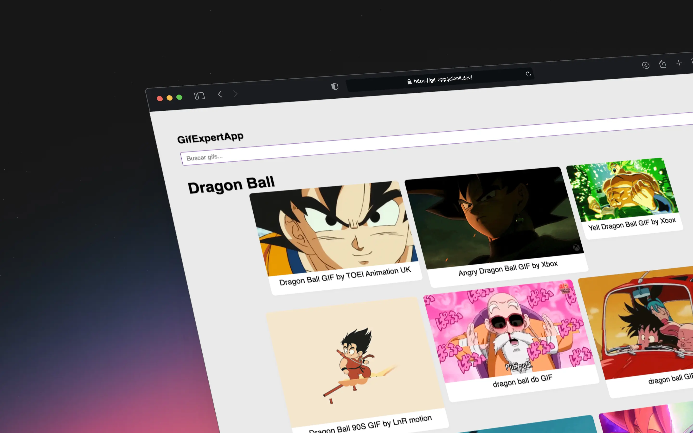

# Gif App

Proyecto para buscar y visualizar gifs utilizando la API de Giphy.


## Instalación

1. Clona el repositorio:
   ```bash
   git clone <URL_DEL_REPOSITORIO>
   ```
2. Navega al directorio del proyecto:
   ```bash
   cd gif-app
   ```
3. Instala las dependencias:
   ```bash
   bun i
   ```
4. Crea un archivo `.env` en la raíz del proyecto y agrega tu clave de API de Giphy:
   ```env
   VITE_GIPHY_API_KEY=tu_clave_de_api
   ```
5. Inicia la aplicación:
   ```bash
   bun run dev
   ```
