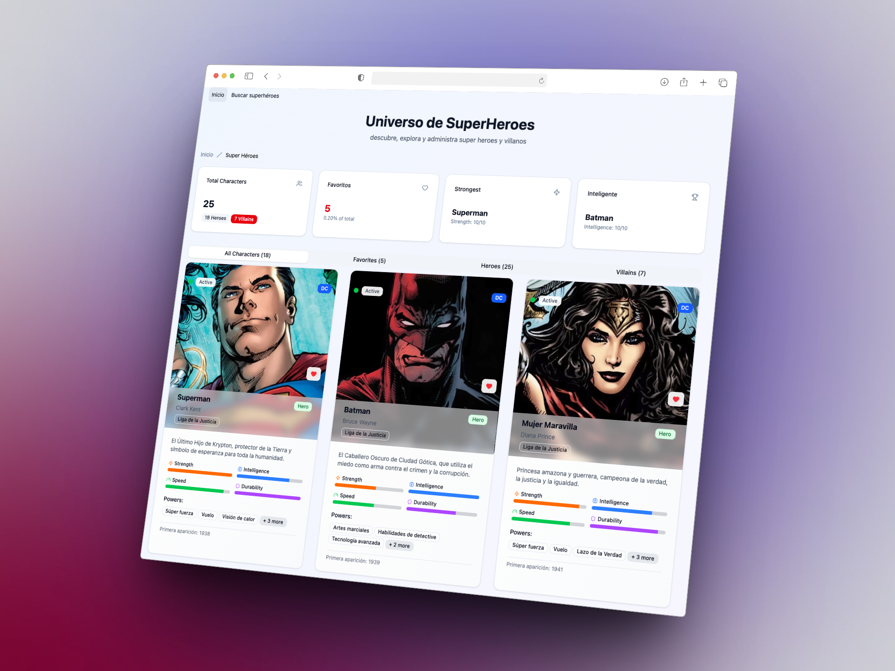

# Heroes APP

## Levantar desarrollo

1. clonar el repositorio
2. instalar dependencias
3. Editar el archivo .env con las variables de entorno
4. Ejecutar `bun i`
5. Ejecutar `bun run dev`

## Levantar Backend

1. Navegar a la carpeta `backend`
2. Crear un archivo `.env` a partir del archivo `.env.example`
3. Ejecutar `bun i`
4. Ejecutar `bun run dev`
