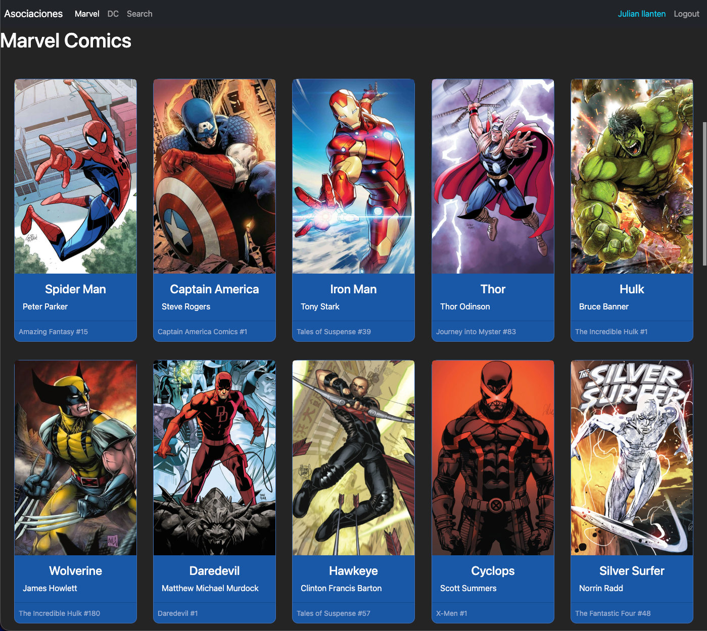

# Proyecto de api de heroes-2022
Este proyecto es un segimiento al curso de react de fernado herrera el cual hace una especie de emulacion a un login y luego muestra la lista de heroes y tambien exite la forma de manipular la url para llamar a los heroes segun su editorial de historietas.




# Instruciones
```sh
    bun i
```

```sh
    bun run dev
```


