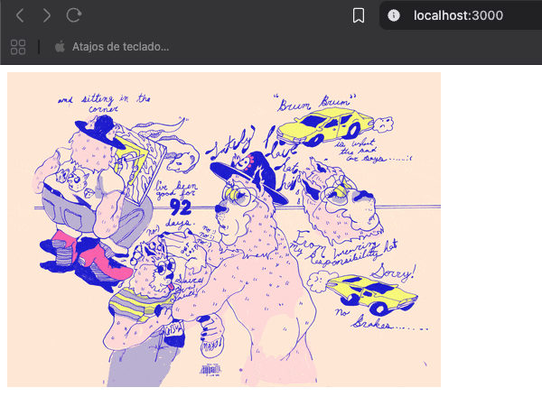

# Introducion a React con su base JavaScript
Este proyecto es una introduccion a lo mas basico que y primordial que es JavaScript antes de ir con React, haciendo una peticon fetch a la api de gifs al endpoint de random gif



## Instrucciones
```sh
    bun i
```
```sh
    bun run dev
```
